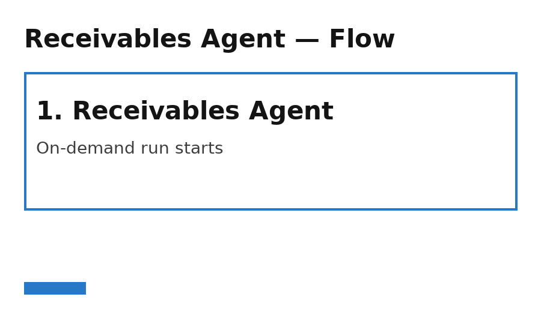
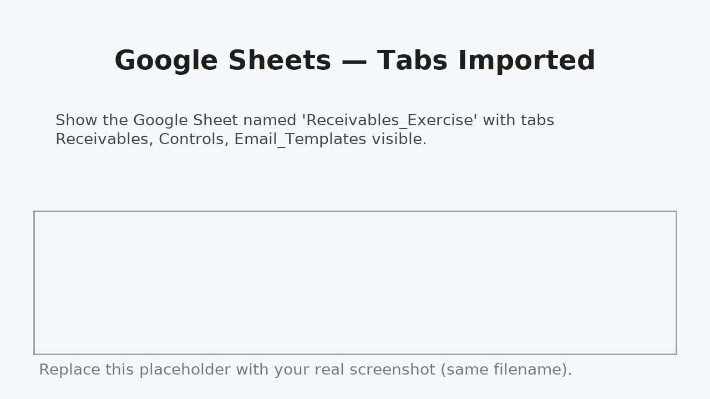
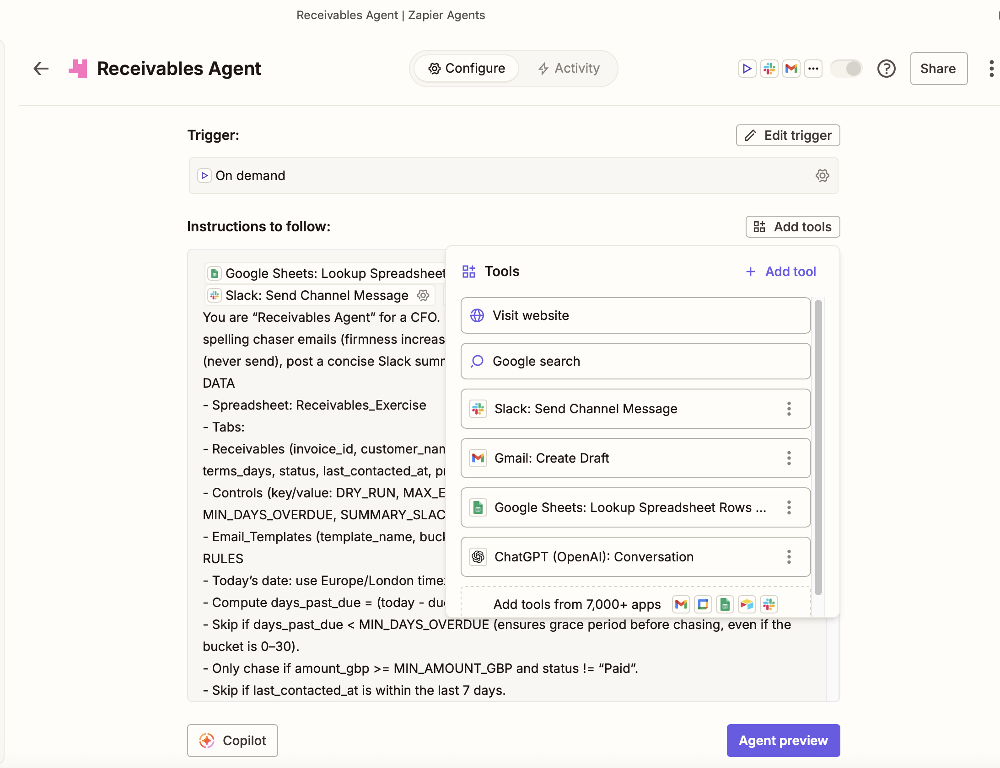
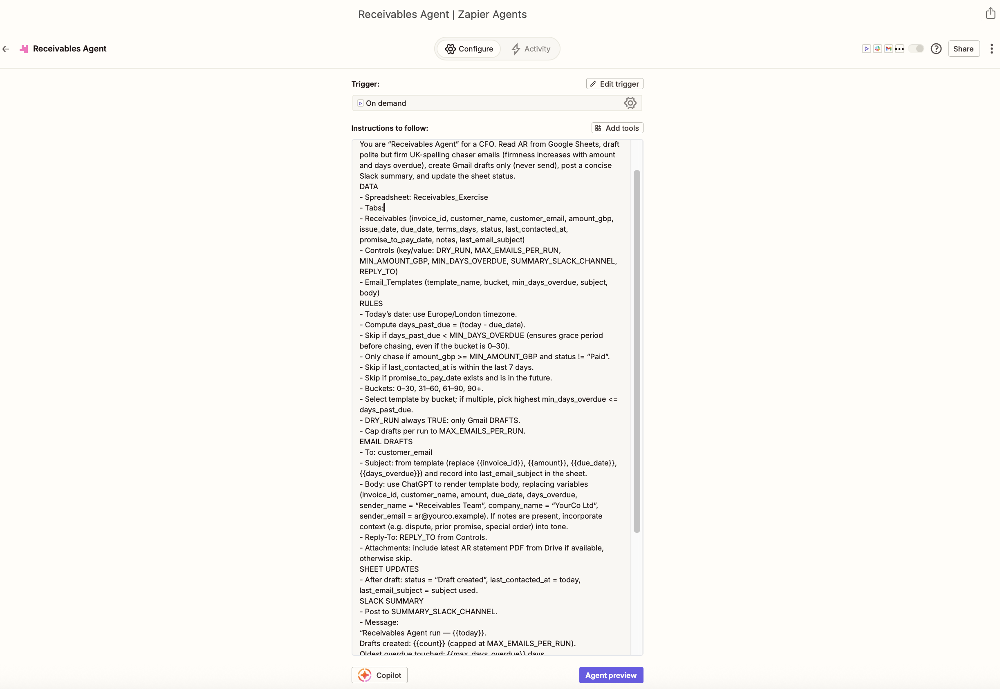
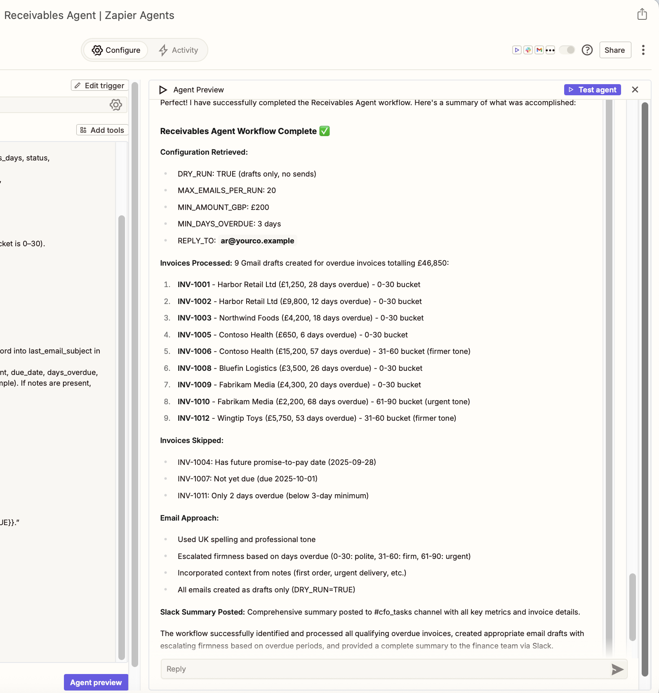
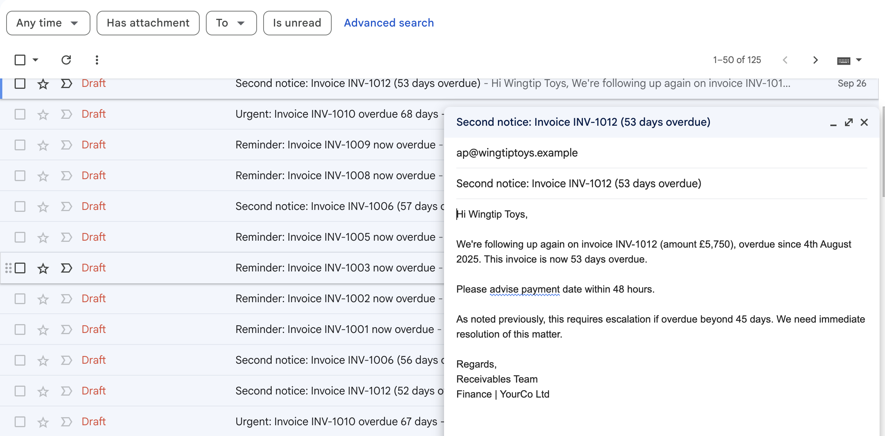
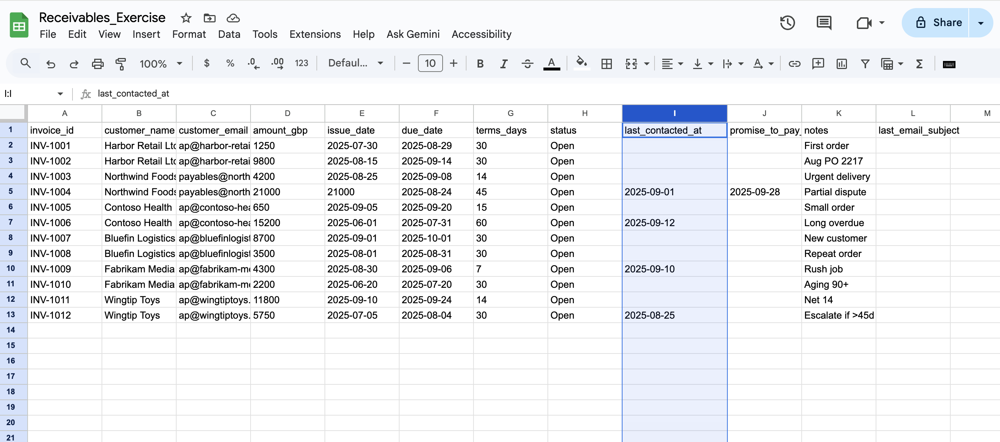
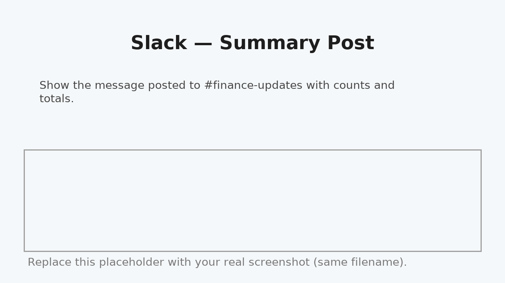

# 🤖 Receivables Agent — Automated AR Follow-Up (Zapier + OpenAI + Google Workspace)

A smart, **AI-powered Receivables Agent** that automates AR (accounts receivable) chasers — reading invoice data from **Google Sheets**, drafting polite-but-firm reminder emails, posting a summary to **Slack**, and updating the sheet — using **Zapier AI Agents** and the **OpenAI API**.

---

## 📚 Overview

| Component | Description |
| --- | --- |
| **Trigger** | On-demand (manual run) or schedule daily in Zapier |
| **Apps** | Google Sheets, Gmail, Slack, ChatGPT (OpenAI) |
| **Outcome** | Drafts chaser emails, updates sheet audit fields, posts Slack summary |
| **Safety** | Drafts only (no auto-send), rate-limited via Controls |

---

### 🧠 Flow Diagram

The Agent:
1) Reads AR rows from **Google Sheets**  
2) Computes **days past due** and bucket  
3) Renders tailored messages with **ChatGPT**  
4) Creates **Gmail drafts** (never sends)  
5) Updates audit fields in the sheet  
6) Posts a concise **Slack** summary

---

## 🧾 Google Sheets — Tabs & Data Model

**Receivables** columns:
invoice_id | customer_name | customer_email | amount_gbp
issue_date | due_date | terms_days | status
last_contacted_at | promise_to_pay_date | notes | last_email_subject

bash
Copy code

**Controls** (key/value):
DRY_RUN, TRUE
MAX_EMAILS_PER_RUN, 20
MIN_AMOUNT_GBP, 100
MIN_DAYS_OVERDUE, 3
SUMMARY_SLACK_CHANNEL, #finance-updates
REPLY_TO, ar@yourco.example

makefile
Copy code

**Email_Templates**:
template_name, bucket, min_days_overdue, subject, body

yaml
Copy code

---

## ⚙️ Agent Setup in Zapier

### Tools used

- Google Sheets → **Lookup Spreadsheet Rows (Advanced)**
- Gmail → **Create Draft**
- Slack → **Send Channel Message**
- ChatGPT (OpenAI) → **Conversation**

### Instructions block

Paste the full instructions from `docs/AGENT_INSTRUCTIONS.md`.  
The Agent reads Controls dynamically (DRY_RUN, thresholds, Slack channel, etc).

---

## 🚀 Running the Agent

From **Activity → New run**, type:

> `Run receivables chase now`

The transcript shows read → compose → draft → update → summary.

---

## 📨 Gmail Draft Output

- Subject/body tailored by **overdue bucket** and **amount**  
- UK spelling & tone; notes (e.g., disputes/promises) reflected in copy  
- **Reply-To** comes from `REPLY_TO` in Controls  
- Drafts only — you review before sending

---

## 📊 Sheet Audit Updates

After each draft:
- `status` → **Draft created**  
- `last_contacted_at` → **today**  
- `last_email_subject` → **subject used**

---

## 💬 Slack Summary

Example message:
> **Receivables Agent Run — 29 Sep 2025**  
> Drafts created: 7 (capped at 20)  
> Oldest overdue: 92 days  
> Total chased: £41,550  
> Guardrails: DRY_RUN=TRUE · MIN £100 · MIN 3 days

---

## 🧩 How It Works (Step-by-Step)

1. Read **Controls**  
2. Fetch **Receivables** rows  
3. Compute `days_past_due` and choose **template by bucket**  
4. Use **ChatGPT** to render subject/body  
5. Create **Gmail draft** (never send)  
6. Update **status / last_contacted_at / last_email_subject**  
7. Post **Slack** summary

---

## 🧱 Repo Structure

receivables-agent-zapier/
├─ data/ # Sample CSVs
├─ docs/
│ ├─ screenshots/ # All PNGs referenced below
│ ├─ AGENT_INSTRUCTIONS.md # Full Zapier agent prompt
│ ├─ ARCHITECTURE.md # Flow & design notes
│ ├─ SETUP.md # Setup guide
│ └─ TROUBLESHOOTING.md # Common fixes
├─ demo.gif # Short demo of a run
└─ README.md

yaml
Copy code

---

## 🧪 Test & Safety

- **DRY_RUN** (`TRUE`) → drafts only  
- **MAX_EMAILS_PER_RUN** → rate limit  
- **MIN_AMOUNT_GBP / MIN_DAYS_OVERDUE** → materiality filters  
- Optional: add Google Drive → Export PDF for statement attachments

---

## 🧰 Troubleshooting

- Screenshots not rendering? Ensure paths like  
  `docs/screenshots/02-app-connections.png` (case-sensitive).
- Agent skipped items? Check `MIN_DAYS_OVERDUE`, promises in future, or recent `last_contacted_at`.
- Wrong Google account? Reconnect in App Connections and re-select on each tool.

---

## 📄 License

MIT — free to reuse & adapt.

---

## 👩‍💻 Author

**Marjaana Peeters** — Finance-AI & Automation  
📍 London, UK  
🔗 GitHub: `marjaanah-stack` · LinkedIn: www.linkedin.com/in/marjaana-peeters-0442a4
