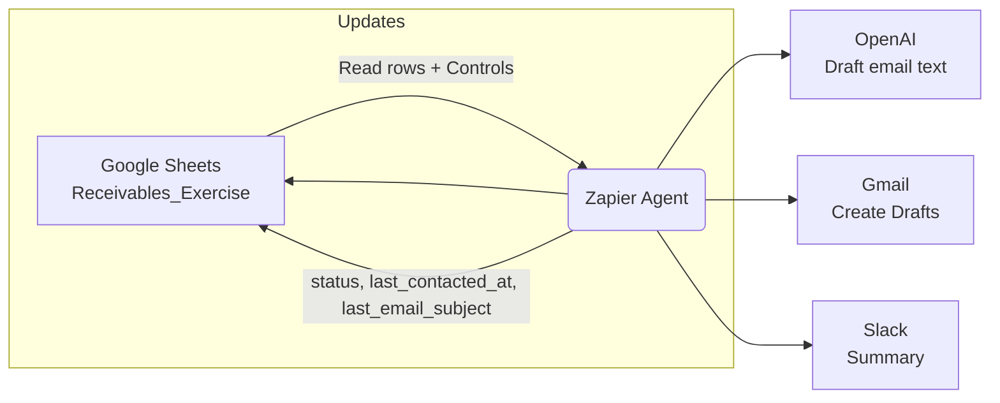
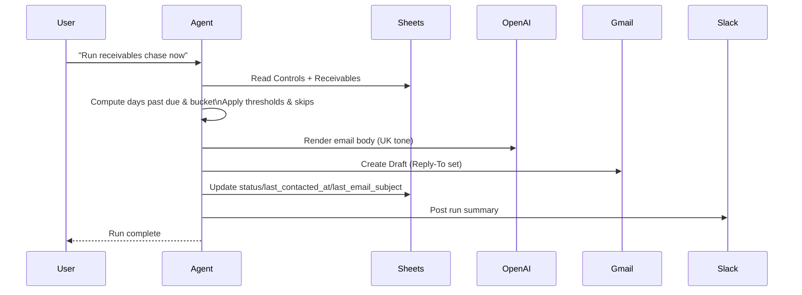

# Architecture

## Flowchart

```mermaid
flowchart LR
  A[Google Sheets\nReceivables_Exercise] -->|Read rows + Controls| B(Zapier Agent)
  B --> C[OpenAI\nDraft email text]
  B --> D[Gmail\nCreate Drafts]
  B --> E[Slack\nSummary]
  B --> A
  subgraph Updates
    B -->|status, last_contacted_at, last_email_subject| A
  end
```

## Sequence

```mermaid
sequenceDiagram
  participant User
  participant Agent
  participant Sheets
  participant OpenAI
  participant Gmail
  participant Slack

  User->>Agent: "Run receivables chase now"
  Agent->>Sheets: Read Controls + Receivables
  Agent->>Agent: Compute days past due & bucket\nApply thresholds & skips
  Agent->>OpenAI: Render email body (UK tone)
  Agent->>Gmail: Create Draft (Reply-To set)
  Agent->>Sheets: Update status/last_contacted_at/last_email_subject
  Agent->>Slack: Post run summary
  Agent-->>User: Run complete
```
