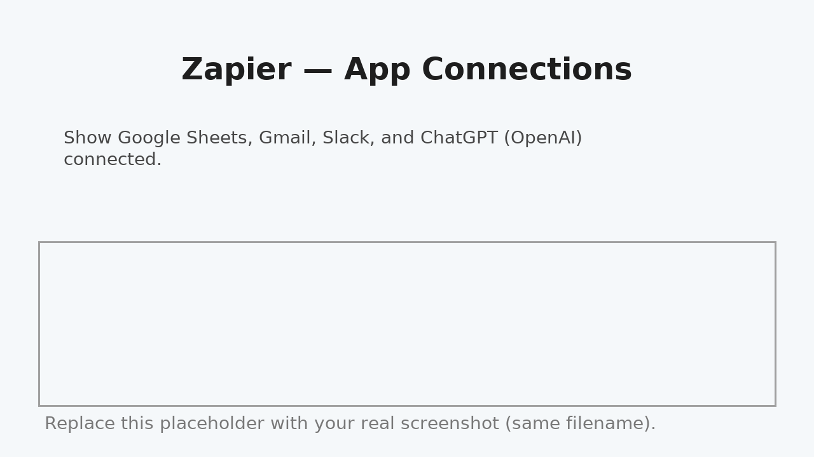

# Setup & Run (Click-by-click)

> These steps are safe: the automation creates **Gmail drafts only** (never sends).

## 1) Google Sheets
1. Create **Receivables_Exercise**.
2. Add tabs and import CSVs from `data/`:
   - **Receivables**
   - **Controls**
   - **Email_Templates**
3. Confirm columns exist: `status`, `last_contacted_at`, `last_email_subject`.
4. (Optional) Format `issue_date` / `due_date` as dates.

## 2) Connect apps in Zapier
- Google Sheets, Gmail, Slack, ChatGPT (OpenAI).  

## 3) Create the Agent
- **Agents → New agent** → *Receivables Agent*.
- **Trigger**: On demand.
- **Add tools** (one each): Sheets (Lookup Advanced) • Gmail (Create Draft) • Slack (Send Channel Message) • ChatGPT (Conversation).

## 4) Paste instructions
Paste from `docs/AGENT_INSTRUCTIONS.md` into **Instructions to follow**.

## 5) Run it
- Agent → **Activity → New run** → type: `Run receivables chase now` (or similar).  
- Review **Gmail → Drafts**, **Slack**, and **Sheet updates**.

## 6) Optional: Attach statements
Add Google Drive → Export or Docs → PDF generation and map file(s) into **Gmail: Create Draft → Attachments**.

## Screenshot checklist
- [ ] App Connections showing four apps connected
- [ ] Agent tools list (Sheets, Gmail, Slack, ChatGPT)
- [ ] Instructions pasted
- [ ] Activity run transcript
- [ ] Gmail drafts view
- [ ] Sheet showing `last_contacted_at` / `last_email_subject` updates
